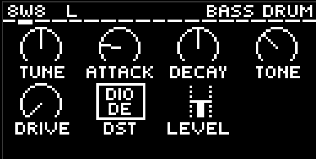
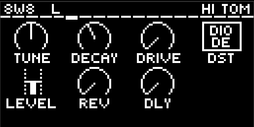
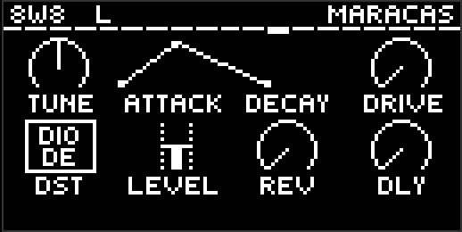
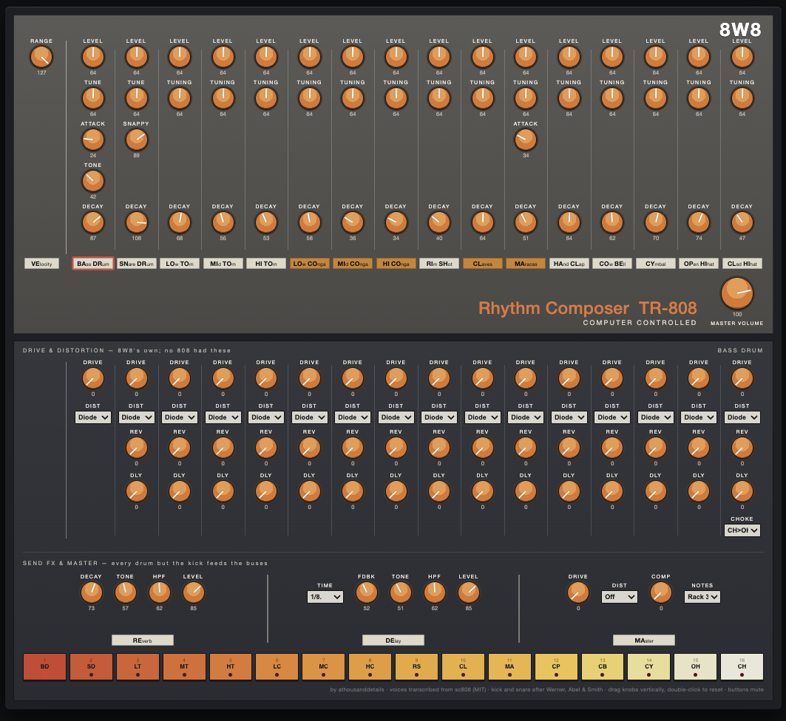

# 8W8 — Rhythm Composer for Ableton Move

A TR-808 style drum machine for [Schwung](https://github.com/charlesvestal/schwung)
on Ableton Move. Sixteen voices, all synthesised, no samples. Fifteen of them
are models of the 808's actual circuits, built from the service notes and the
published analyses; the sixteenth — the rim shot — is a transcription of Sonic
Pi's sc808.





Sixteen drums fill Move's left 4×4 pad block exactly — where
[6W6](https://github.com/athousanddetails/schwung-6W6) uses half the block and
[9W9](https://github.com/athousanddetails/schwung-9W9) eleven pads. There is no
Master pad, because sixteen drums leave no room for one; Master is on the jog
with every other page.

## Voices

8W8 models the circuit, then checks the result against hardware recordings and
against Roland's own plugin; where the two disagree, the ear decides and the
voice is re-fitted.

| Voice | Engine |
|---|---|
| Bass Drum | A bridged-T network in an op-amp feedback loop, so **Decay is loop gain**, not an envelope — the pitch sighs, the attack is a real octave jump, and fast repeats never machine-gun |
| Snare | Two bridged-T shells at 173 and 336 Hz from the service notes' component values, decaying at their own rates. **Snappy** is a divider on the trigger, so it sets the noise's length as well as its level |
| Low / Mid / Hi Tom | A bridged-T at Q 10.8 ringing in a feedback loop — F2/C3/G3, ring 0.39/0.23/0.18 s — with the machine's pink noise alongside the trigger as the drum head |
| Low / Mid / Hi Conga | The same channel with the switch the other way: struck soft, no head, ringing twice as long, and tuned an octave-plus above its tom — G3/D4/A4, as measured |
| Rim Shot | **The one sc808 voice.** Two circuit rim shots were built from the schematic and both lost on hardware, so the transcription is the rim, tuned so the tock lands on 1788 Hz |
| Claves | The clave network with the switch's 1k shunt: 2524 Hz at Q 14, ringing 30 ms as Roland's own model does |
| Maracas | Bus noise high-passed hard, 39 ms to silence |
| Hand Clap | Three noise bursts about 10 ms apart into a 330 ms tail (R362 × C143), through the 874 Hz bandpass R342/R334/C128 make. One knob: Decay, the tail |
| Cowbell | Oscillators 5 and 6 of the shared Schmitt bank, exactly as the hardware wires them |
| Closed / Open Hat | The shared bank through each hat's C-R ladder — 1.5 nF open, 1.0 nF closed, which is why the closed hat is the thinner voice — and a swing VCA whose diode gates the tail dead |
| Cymbal | Werner's three-path structure voiced to a reference recording: two band passes, a linear-discharge shimmer, and a brushed floor under the crash |

There is **one metal bank**, ticked once per sample and shared by the cowbell,
both hats and the cymbal, exactly as the hardware wires half an HD14584. It
free-runs, so every hit catches it at a different phase and no two hats are
quite the same.

Every voice has **Tune, Decay, Drive, a Distortion type, Level** and — every
one except the kick — a pair of **send amounts (Rev, Dly)**. Every continuous
control is a **0–127 pot**, like the hardware — no Hz, no ms.

**Seven distortion characters**, per voice and again on the master bus. The
same seven 9W9 and 6W6 offer, so the knob means the same thing on all three:

| | |
|---|---|
| **Diode** | the machine's own back-to-back diode rounding |
| **Clip** | asymmetric soft clip, even harmonics and all |
| **SAT** | warm parallel saturation that keeps the transient |
| **BFZ** | thick fuzz wall |
| **PDIST** | biased cubic crunch |
| **Fold** | wavefolder, metallic without hollowing the note out |
| **Crush** | bit depth and sample rate falling together |

**Drive fully down is exactly dry** — the stage is not in the path at all, for
every type, and that is the default. The 808 had no drive stage, so a fresh
patch has none, and the knob adds saturation rather than level.

**Hat choke is a switch**: Off, CH cuts OH (the hardware's shared metal
source), or Mutual.

## Send FX

Two buses, fed post-fader from every voice by its **Rev** and **Dly** knobs
and returned before the master stages, so Master Drive/Distortion and the Comp
work on the wet signal too. Both are silent at zero, so the kit is untouched
until you send it something.

**Every voice except the kick** has sends. The kick stays dry on purpose:
reverb on an 808 kick is mud, and the low end is what each bus's input HPF
exists to keep out of the wet path.

| | |
|---|---|
| **Reverb** | Four combs into two allpasses with the loop quantised to 12 bits, for the early-rack grain. Decay, Tone (loop damping), HPF, Level |
| **Delay** | Time is a **note division**, not milliseconds, and follows the host tempo: 1/32, 1/16T, 1/16, 1/8T, 1/16., 1/8, 1/4T, 1/8., 1/4, 1/2T, 1/4., 1/2, 1/2. The line is slewed, so changing tempo or division warps the echo like tape instead of clicking. Fdbk, Tone, HPF, Level |

## Master

**Master Dist** and **Drive** across the kit, a one-knob **Comp** for glue
(hard bypass at zero, with AutoGain fitted so loudness stays flat as you turn
it up), **Volume**, **Velocity**, the hat **Choke** and the **Note Map**
switch. There is no always-on compressor or limiter anywhere else in the
signal path.

**Velocity plays.** Level follows velocity all the way up — no accent switch
and no step in the middle — and a hit at 127 is the loudest the kit gets. The
**Velocity** control is how far a soft hit falls below that: at zero every hit
comes out the same however hard you play, at full the range is wide open. It
only ever carves downwards, so turning it up never makes anything louder.

There is no Accent control: velocity replaced it. The level a full-velocity
hit reaches is exactly the level accented hits always had, so nothing you have
made gets quieter.

On most of these voices velocity is a trigger **voltage** rather than a gain,
because that is what the circuit does — a harder hit is a slightly different
sound and not only a louder one.

## Workflow on the Move

- **Pads (left 4×4)** play and select drums; the parameter page follows what
  you hit. Row 1: BD SD LT MT. Row 2: HT LC MC HC. Row 3: RS CL MA CP. Row 4:
  CB CH OH CY. All sixteen are drums, so **Master**, **Reverb** and **Delay**
  are reached by the jog rather than by a pad. **Shift+Pad** selects silently
  (works during playback). **Mute+Pad** mutes that drum (`[M]` in the title
  bar).
- **Main-page lock:** press the **jog while on Main** to lock it (`[L]` in the
  title bar). Pads still play and record, but the page stops following them,
  so the master knobs stay under your hands while you jam. Shift+Pad still
  selects, and another jog click unlocks.
- **Knobs 1–8** edit the visible page, drawn with Schwung's stock knob grid
  (host 0.12.1+): **jog** cycles pages, **Shift+Jog** jumps sections, **jog
  click** opens the section list, **Shift** reveals values / fine mode,
  **Mute+knob** resets a pot to its default.
- **Sequencing:** use Move's own sequencer — a drum track with a kit, muted
  (HiJack), track MIDI OUT on the slot's channel. Each drum is its own lane.
  Note map: drum rack (36–51, default) or General MIDI, switchable.

## Remote panel

A full 808-style editor in the browser — every drum with draggable knobs,
per-drum mute buttons (synced with Mute+Pad on the device), distortion
selectors, the send amounts, the Reverb and Delay sections and Master, with
the device's current page highlighted. Open `move.local:7700` → **Remote UI**
while 8W8 is the slot's synth.



Top deck is the 808's own panel. Middle deck is Drive, Distortion and the two
send amounts per drum — none of which an 808 had, which is what the header
says. Bottom row is the send buses and Master.

## Install

Requires Schwung **0.12.1 or newer**. Via the Schwung Module Store /
[schwung-manager](https://github.com/charlesvestal/schwung), or manually:
build, then copy `dist/8w8/` to
`/data/UserData/schwung/modules/sound_generators/8w8/` on the device.

## Building

Requires Docker (cross-compiles for the Move's ARM64, pinned to glibc 2.35):

```bash
./scripts/build.sh all            # builds build/dsp.so + dist/8w8-module.tar.gz
./scripts/deploy.sh move.local    # safe deploy (atomic rename, never over a live .so)
```

`scripts/build.sh` also builds `sc808_loadtest`, an on-device test that
dlopens the real `dsp.so` exactly as Schwung's chain host does and checks that
every pad sounds, that every generated parameter key resolves, mutes, the hat
choke, the send buses and state round-trip — end to end.

The parameter surface has one source: `scripts/gen_params.py` generates the
pot table, `chain_params` and the page hierarchy from a single dict. Adding a
control is one edit.

`./test/all.sh` runs everything that does not need the device: the null test
against SuperCollider, the per-voice circuit checks, the drive and velocity
probes, the editor tests, and a golden render that compares every lane against
a stored baseline so a change to the engine cannot quietly move the kit. Steps
whose tooling is missing report **SKIP** and say so, rather than passing
quietly.

## Credits and provenance

8W8 stands on other people's work and says so:

- **[sc808](https://github.com/sonic-pi-net/sonic-pi/blob/dev/etc/synthdefs/designs/supercollider/sc808.scd)**
  — the 808 SynthDefs by **Yoshinosuke Horiuchi**, adapted for Sonic Pi by
  **Sam Aaron**, MIT. Vendored under `src/vendor/sc808`. **Exactly one voice
  you hear is one of these: the rim shot.** The other fifteen lanes are
  circuit models and are not transcriptions of anything. The rest of the
  transcription is still in the tree and still verified by the null test,
  because it is what the circuit models were measured against on the way in
  and it is what keeps `sc_ugens.h` honest.
- **Werner, Abel and Smith**, *A Physically-Informed, Circuit-Bendable,
  Digital Model of the Roland TR-808 Bass Drum Circuit* (DAFx-14) and *The
  TR-808 Cymbal* (ICMC|SMC 2014) — the circuit analysis the kick, the snare's
  VCA and the cymbal are built from. Cited, not copied; the headers say
  exactly which parts are theirs and which are re-derived, and why.
- **SuperCollider** by James McCartney and contributors — `sc_ugens.h`
  reimplements the UGens sc808 uses, each one naming the source file its
  behaviour was read out of. Pinned to 3.11.2, and that matters.
- **[9W9](https://github.com/athousanddetails/schwung-9W9)** and
  **[6W6](https://github.com/athousanddetails/schwung-6W6)** — the module
  architecture, pad gestures, the Main-page lock, the seven distortion
  characters, the reverb/delay buses and the one-knob glue, so all three kits
  feel identical under the hands. The maths is theirs, copied rather than
  re-derived; where 8W8 departs, the source says why.
- Voice behaviour worked out from the **TR-808 service notes** (schematics,
  parts list and scope traces) and checked against Roland's own TR-808 plugin
  rendered offline.
- **[Schwung](https://github.com/charlesvestal/schwung)** by Charles Vestal
  and contributors — the platform and the shared `param_pages` knob grid.

This project was developed with AI assistance (Claude), with human direction
and on-hardware verification throughout.

## Contributing

**Contributions are open to anyone, any time — just submit a PR.** Voice
tweaks, new distortion flavours, UI improvements, docs, bug
reports: all welcome. If you touch a voice, run `./test/nulltest.sh` **and**
`golden_check` — the latter is what proves you did not move the kit by
accident. Please note in your PR which AI tools you used, if any (same policy
as Schwung upstream).

## License

GPL-3.0 — see [LICENSE](LICENSE) and [THIRD_PARTY.md](THIRD_PARTY.md).
sc808-derived code keeps its MIT licensing, which is GPL-3.0 compatible.

## Disclaimer

Not affiliated with, approved or endorsed by Ableton or Roland. TR-808 is a
trademark of Roland Corporation, referenced only to describe behaviour.
